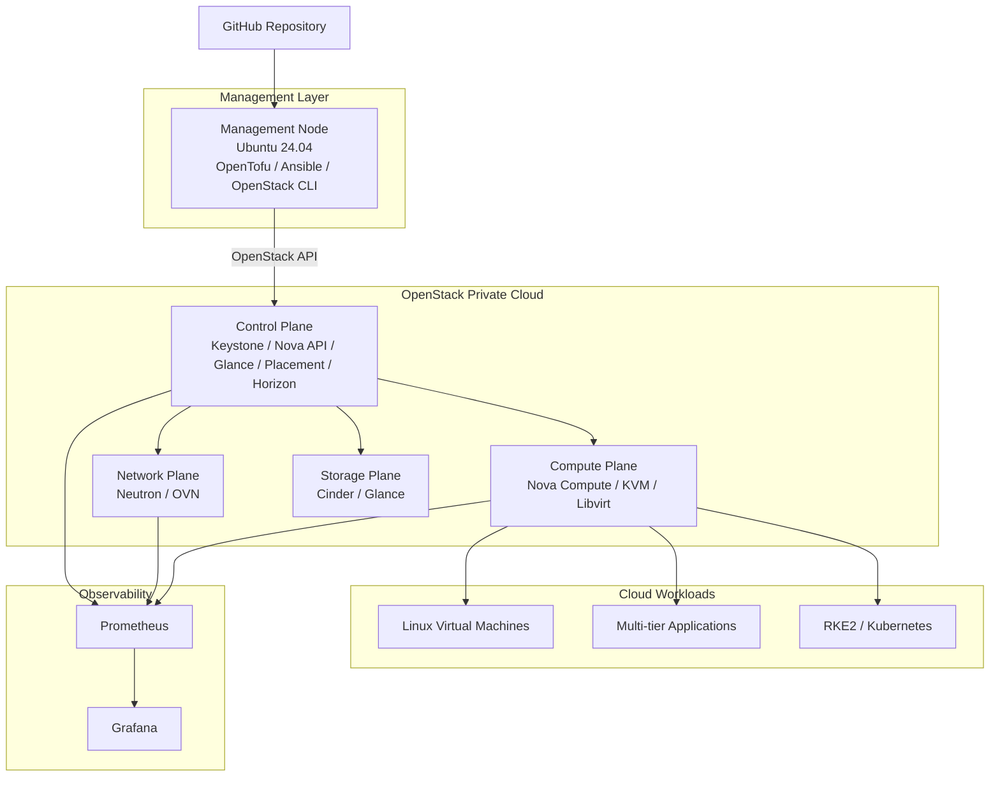
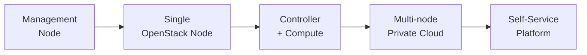

# OpenStack Private Cloud Platform Architecture

## Overview

This project implements a production-inspired private cloud platform based on OpenStack.

The architecture separates the management and automation layer from the OpenStack infrastructure itself. This allows the platform to evolve from a compact private cloud deployment into a multi-node private cloud without redesigning the automation model.

## Architecture

## Management Layer

The management node provides the operational entry point for the platform.

Responsibilities include:

- Infrastructure as Code with OpenTofu.
- Configuration management with Ansible.
- OpenStack CLI operations.
- Platform automation.
- Deployment orchestration.
- Validation and operational tooling.
- Git-based configuration management.

The management node does not need to host OpenStack control-plane services.

## OpenStack Layer

The OpenStack cloud provides the Infrastructure-as-a-Service layer.

Core services include:

- Keystone for identity.
- Nova for compute.
- Neutron and OVN for networking.
- Glance for image management.
- Cinder for block storage.
- Placement for resource tracking.
- Horizon for web administration.

## Compute Layer

Cloud instances are executed through:

- Nova Compute.
- KVM.
- QEMU.
- Libvirt.

Compute nodes require hardware virtualization support.

## Workload Layer

The platform will deploy realistic workloads rather than only test instances.

Initial scenarios include:

- Standalone Linux virtual machines.
- Multi-tier application environments.
- Reusable development environments.
- RKE2 Kubernetes clusters.

## Infrastructure as Code

OpenTofu will provision resources including:

- Projects.
- Networks.
- Subnets.
- Routers.
- Security groups.
- SSH key pairs.
- Instances.
- Floating IP addresses.
- Block volumes.

Infrastructure should be reproducible, versioned and disposable.

## Configuration Management

Ansible will provide post-provisioning configuration for:

- Base Linux configuration.
- Package installation.
- SSH configuration.
- User management.
- Kubernetes node preparation.
- RKE2 installation.
- Application deployment.

## Observability

The platform will progressively integrate:

- Prometheus.
- Grafana.
- OpenStack exporters.
- Infrastructure metrics.
- Capacity monitoring.
- Network visibility.

## Platform Evolution

## Design Principles

1. Infrastructure must be reproducible.
2. Manual configuration should be minimized.
3. Infrastructure and workloads must remain separated.
4. Credentials and secrets must never be stored in Git.
5. Components should be replaceable and scalable.
6. Deployment and operational procedures must be documented.
7. The platform must support real operational workflows rather than only installation procedures.
